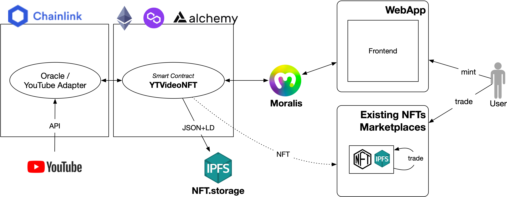

# YouTube Video NFT Tokenizer

Mint trustful NFTs for your YouTube videos. Ownership is checked by an oracle that consumes YouTube's API and 
the terms licensed to the NFT owner are defined using semantic NFT metadata.

## Features

* **YouTube Video NFTs** with multiple **editions** for the same video identifier.
* Video **ownership verification** using a **Chainlink oracle**.
* **Rich NFT metadata** stating the **terms licensed** to the owner using **semantic metadata and ontologies**.
* Semantic metadata representation using JSON-LD but compatible with existing **NFT marketplaces**, so NFTs can be traded there.
* **Frontend** that facilitates user experience, including verifying that the YouTube video exists, fetching its title, 
or monitoring oracle verification events so the users get **feedback through the whole minting process**.

## Architecture



## Notes

Based on Chainlink's [Hardhat Starter Kit](https://github.com/smartcontractkit/hardhat-starter-kit) and 
[React Moralis](https://github.com/MoralisWeb3/react-moralis) for the frontend.

## Installation

## Requirements

- [NPM](https://www.npmjs.com/) or [YARN](https://yarnpkg.com/)

### Rinkeby Ethereum Testnet
Set your `RINKEBY_RPC_URL` 

### Matic Mumbai Testnet
Set your `MUMBAI_RPC_URL`

### Setting Environment Variables
You can set these in your `.env` file. If you're unfamiliar with how setting environment variables work, 
check out our [.env example](https://github.com/rogargon/YTVideoNFTknz/blob/main/.env.example). 
If you wish to use this method to set these variables, update the values in the .env.example file, 
and then rename it to '.env'.

If you plan on deploying to a local [Hardhat network](https://hardhat.org/hardhat-network/) that's a fork of the 
Ethereum mainnet instead of a public test network, you'll also need to set your `MAINNET_RPC_URL` environment variable
and uncomment the `forking` section in `hardhat.config.js`. 
You can get one for free at [Alchemy's site.](https://alchemyapi.io/).

You can also use a `PRIVATE_KEY` instead of a `MNEMONIC` environment variable by uncommenting the section in the 
`hardhat.config.js`, and commenting out the `MNEMONIC` line.

Then you can install all the dependencies.

```bash
git clone https://github.com/rogargon/YTVideoNFTknz/
cd YTVideoNFTknz
```
then

```bash
npm install
```

Or

```bash
yarn
```

## Auto-Funding

This Starter Kit is configured by default to attempt to auto-fund any newly deployed contract 
that uses Any-API or Chainlink VRF, to save having to manually fund them after each deployment. 
The amount in LINK to send as part of this process can be modified in the 
[Starter Kit Config](https://github.com/rogargon/YTVideoNFTknz/blob/main/helper-hardhat-config.js), 
and are configurable per network.

| Parameter  | Description                                       | Default Value |
| ---------- | :------------------------------------------------ | :------------ |
| fundAmount | Amount of LINK to transfer when funding contracts | 1 LINK        |

If you wish to deploy the smart contracts without performing the auto-funding, 
run the following command when doing your deployment:

```bash
npx hardhat deploy --tags main
```


## Deploy

Deployment scripts are in the [deploy](https://github.com/rogargon/YTVideoNFTknz/tree/main/deploy) directory.

This will deploy to a local hardhat network:

```bash
npx hardhat deploy
```

To deploy to testnet:
```bash
npx hardhat deploy --network kovan
```

## Test
Tests are located in the [test](https://github.com/rogargon/YTVideoNFTknz/tree/main/test) directory.

To run tests:

```bash
yarn test
```

## Verify on Etherscan

You'll need an `ETHERSCAN_API_KEY` environment variable. 
You can get one from the [Etherscan API site.](https://etherscan.io/apis)

```
npx hardhat verify --network <NETWORK> <CONTRACT_ADDRESS> <CONSTRUCTOR_PARAMETERS>
```
example:

```
npx hardhat verify --network kovan 0x9279791897f112a41FfDa267ff7DbBC46b96c296 "0x9326BFA02ADD2366b30bacB125260Af641031331"
```

### Linting

```
yarn lint:fix
```
